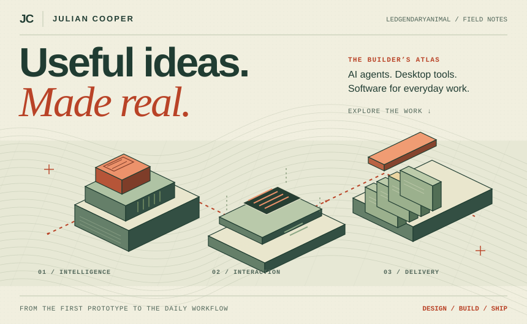
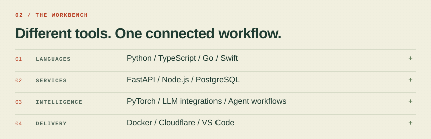
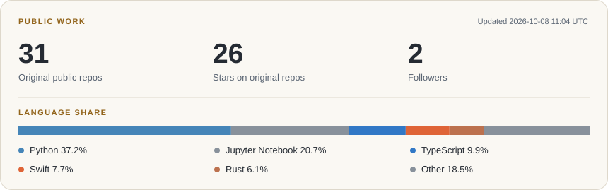

<picture>
  <source media="(prefers-color-scheme: dark)" srcset="./assets/hero-dark.svg">
  
</picture>

**AI applications & agents · Desktop tools · Full-stack delivery**

[**Portfolio ↗**](https://ledgendaryanimal.top/) &nbsp; / &nbsp; [**Work with me ↗**](https://www.upwork.com/freelancers/~010ed7d7ca20321c68) &nbsp; / &nbsp; [**Security research ↗**](https://hackerone.com/ledgendaryanimal)

### From idea to everyday use.

I build AI workflows, desktop software, and web products that fit into everyday work. My focus is taking useful ideas from prototype through deployment and ongoing operations.

- **AI engineering** — LLM integrations, agent workflows, model routing, and automation with human review.
- **Desktop & developer tools** — voice input, touchpad interactions, and tools that stay close to your workflow.
- **Product delivery** — interfaces, backend services, deployment, and maintenance.

### 01 / Projects & products

| Product | Built for | Explore |
| :--- | :--- | :--- |
| **InkTyper** | Voice-to-text, optional AI editing, global shortcuts, and tray controls | [Website](https://inktyper.ledgendaryanimal.top/) · [Downloads](https://github.com/Cooperiano/InkTyper-Releases) |
| **Mac-like Touchpad** | Continuous three-finger dragging and four-finger workspace gestures on Ubuntu; reversible Windows touchpad configuration | [Source & setup](https://github.com/Cooperiano/mac-like-touchpad-ubuntu) |
| **Mihomo Switch** | Keyboard-driven Mihomo/Clash proxy control inside VS Code | [Source & docs](https://github.com/Cooperiano/mihomo-switch) |
| **Ledgendaryanimal Academy** | Video research, organized notes, subtitles, and timelines brought back to the original viewing page | [Explore](https://academy.ledgendaryanimal.top/) |
| **Soyetty** | Commercial network services | [Website](https://soyetty.com/) |
| **Julian Rides** | An independent English cycling journal: stories, gear, data, and guides | [Read](https://julianrides.com/) |

### 02 / Agents & experiments

- **[AI Server Operator](https://github.com/Cooperiano/ai-server-operator)** — Linux operations with a diagnose, approve, fix, and verify workflow.
- **[Media Generation Pipeline](https://github.com/Cooperiano/media-generation-pipeline)** — Natural-language requests translated into ComfyUI workflows.
- **[AgentWire](https://github.com/Cooperiano/agentwire)** — A publishing and discussion network for people and AI agents.

[Browse my public repositories →](https://github.com/Cooperiano?tab=repositories)

### 03 / Toolkit

<picture>
  <source media="(prefers-color-scheme: dark)" srcset="./assets/stack-dark.svg">
  
</picture>

### 04 / Public signal

<picture>
  <source media="(prefers-color-scheme: dark)" srcset="./assets/activity-dark.svg">
  
</picture>

Public repositories only. Language share measures code volume, not skill. Cards refresh daily; their last successful update is shown above.

More about this profile

The banner, technology badges, and GitHub cards are served from this repository. The banner includes rotating wireframe rings, a scanning light, and a terminal-style text animation. A complete static image remains readable when motion is reduced or unavailable. GitHub Actions refreshes the cards daily using public GitHub data. No private repository data or personal access token is needed.

The optional counter below is supplied by Komarev and measures image requests rather than unique visitors. It may be affected by caching.

---

**Have something useful in mind?** I'm open to freelance and product engineering work involving AI applications, desktop tools, and full-stack delivery.

[Work with me on Upwork](https://www.upwork.com/freelancers/~010ed7d7ca20321c68) · [Personal website](https://ledgendaryanimal.top/) · [HackerOne](https://hackerone.com/ledgendaryanimal)

Julian Cooper / Ledgendaryanimal · Profile text, code, and original artwork: [MIT](LICENSE). Linked projects retain their own licenses.

