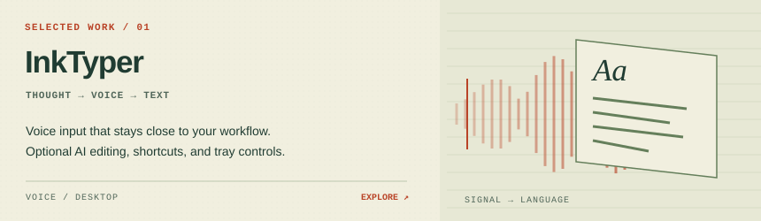
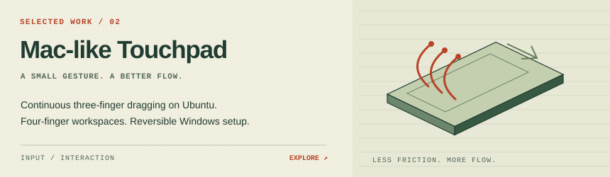
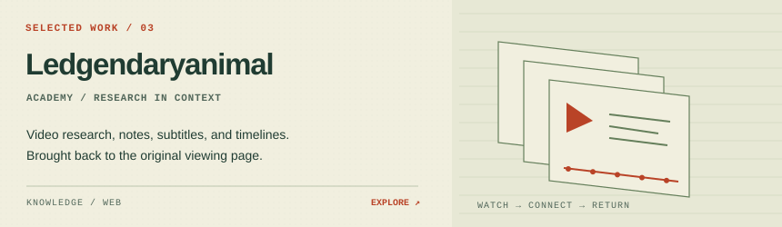
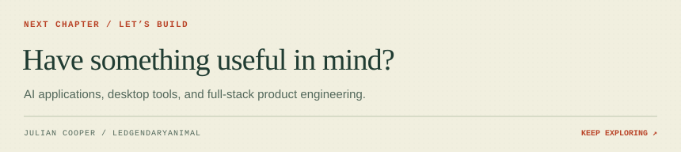

<picture>
  <source media="(prefers-color-scheme: dark)" srcset="./assets/hero-dark.svg">
  
</picture>

  <a href="https://ledgendaryanimal.top/"><strong>PORTFOLIO ↗</strong></a> &nbsp; &nbsp; / &nbsp; &nbsp;
  <a href="https://www.upwork.com/freelancers/~010ed7d7ca20321c68"><strong>WORK WITH ME ↗</strong></a> &nbsp; &nbsp; / &nbsp; &nbsp;
  <a href="https://hackerone.com/ledgendaryanimal"><strong>SECURITY RESEARCH ↗</strong></a>

I’m **Julian Cooper**, also known as **Ledgendaryanimal**. I build AI workflows, desktop software, and web products that fit into everyday work—from the first useful prototype to deployment and ongoing operations.

**My throughline:** connect intelligence to interfaces people can actually use. LLM integrations and agents, thoughtful desktop interactions, and the services that keep a product running.

### 01 / Selected work

<a href="https://inktyper.ledgendaryanimal.top/">
<picture>
  <source media="(prefers-color-scheme: dark)" srcset="./assets/inktyper-dark.svg">
  
</picture>
</a>

[**InkTyper / Website ↗**](https://inktyper.ledgendaryanimal.top/) · [Release downloads](https://github.com/Cooperiano/InkTyper-Releases) 
Voice-to-text with optional AI editing, global shortcuts, and tray controls.

<a href="https://github.com/Cooperiano/mac-like-touchpad-ubuntu">
<picture>
  <source media="(prefers-color-scheme: dark)" srcset="./assets/touchpad-dark.svg">
  
</picture>
</a>

[**Mac-like Touchpad / Source & setup ↗**](https://github.com/Cooperiano/mac-like-touchpad-ubuntu) 
Continuous three-finger dragging and four-finger workspace gestures on Ubuntu; reversible Windows touchpad configuration.

<a href="https://academy.ledgendaryanimal.top/">
<picture>
  <source media="(prefers-color-scheme: dark)" srcset="./assets/academy-dark.svg">
  
</picture>
</a>

[**Ledgendaryanimal Academy / Explore ↗**](https://academy.ledgendaryanimal.top/) 
Video research, notes, subtitles, and timelines brought back to the original viewing page.

**Elsewhere in the workshop**

| | Project | What it does |
| :--- | :--- | :--- |
| `04` | [**Mihomo Switch ↗**](https://github.com/Cooperiano/mihomo-switch) | Keyboard-driven Mihomo/Clash proxy control inside VS Code. |
| `05` | [**Soyetty ↗**](https://soyetty.com/) | Commercial network services. |
| `06` | [**Julian Rides ↗**](https://julianrides.com/) | An independent English cycling journal: stories, gear, data, and guides. |

**Agents & experiments**

- [**AI Server Operator ↗**](https://github.com/Cooperiano/ai-server-operator) — Linux operations with a diagnose, approve, fix, and verify workflow.
- [**Media Generation Pipeline ↗**](https://github.com/Cooperiano/media-generation-pipeline) — Natural-language requests translated into ComfyUI workflows.
- [**AgentWire ↗**](https://github.com/Cooperiano/agentwire) — A publishing and discussion network for people and AI agents.

[Browse all public repositories →](https://github.com/Cooperiano?tab=repositories)

<picture>
  <source media="(prefers-color-scheme: dark)" srcset="./assets/stack-dark.svg">
  
</picture>

<picture>
  <source media="(prefers-color-scheme: dark)" srcset="./assets/activity-dark.svg">
  
</picture>

Public repositories only. Language share measures code volume, not skill. Refreshed daily; the artwork shows the last successful update.

<a href="https://www.upwork.com/freelancers/~010ed7d7ca20321c68">
<picture>
  <source media="(prefers-color-scheme: dark)" srcset="./assets/footer-dark.svg">
  
</picture>
</a>

  <a href="https://www.upwork.com/freelancers/~010ed7d7ca20321c68"><strong>Start a conversation on Upwork ↗</strong></a> &nbsp; · &nbsp;
  <a href="https://ledgendaryanimal.top/">Personal website</a> &nbsp; · &nbsp;
  <a href="https://hackerone.com/ledgendaryanimal">HackerOne</a>

Colophon / About this living atlas

Original, repository-hosted SVG artwork with light and dark editions. The atlas includes a moving signal and a subtle voice pulse; all illustrations remain complete when animation is unavailable, and reduced-motion preferences are respected. GitHub Actions refreshes the public observatory daily at 09:17 Beijing time using public GitHub data. No private repository data or personal access token is needed.

The optional counter below is supplied by Komarev. It measures image requests, not unique visitors, and may be affected by caching.

  

Julian Cooper / Ledgendaryanimal · Profile text, code, and original artwork: <a href="LICENSE">MIT</a>. Linked projects retain their own licenses.

